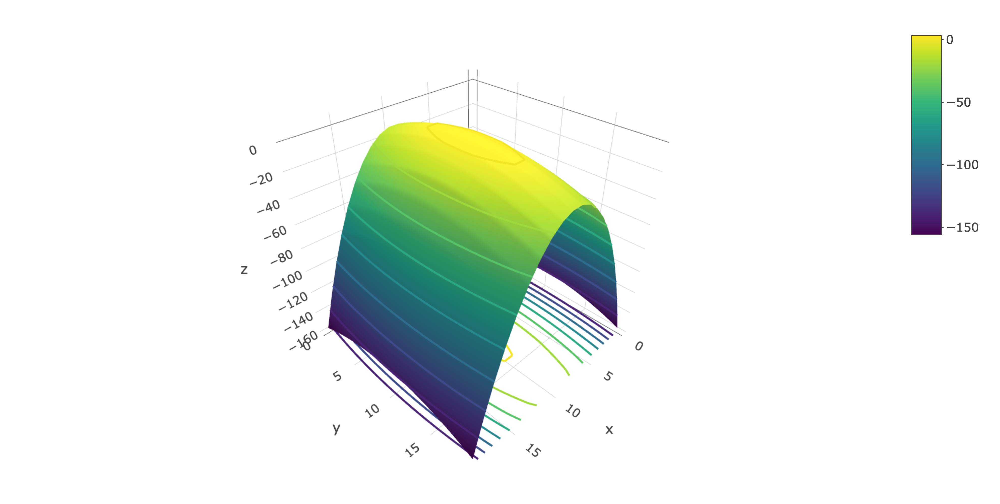

# Partial Derivatives

```{r, message = FALSE}
library(tidyverse)
library(plotly)
library(dasc2594)
set.seed(2021)
```

```{r, echo = FALSE}
# make shure orca is installed
# https://github.com/plotly/orca#installation
# from terminal 
# conda install -c plotly plotly-orca

# using webshot2 github package
# devtools::install_github("rstudio/webshot2")
# if (!webshot::is_phantomjs_installed()) {
#     webshot::install_phantomjs()
# }
```

Recall that for a function of one variable, the derivative gives the rate of change of the function with respect to that variable. The function $f(x)$ has an instantaneous rate of change $\frac{d}{dx}f(x)$, assuming the derivative $\frac{d}{dx}f(x)$ exists. 

This concept can be extended to functions of multivariables where we now have to specify a direction in which the function changes. For example, consider a mountain which is very steep in the north/south direction but is much less steep in the east/west direction. Thus, the directional derivative in the north/south direction will have a larger absolute value (higher rate of change) than the directional derivative in the east/west direction. 

For example, consider the function
```{r}
mountain <- function(x, y) {
    4 - 9 * x^2 - y^2
}
dat <- expand_grid(x = seq(-4, 4, length.out = 20), y = seq(-4, 4, length.out = 20)) %>%
    mutate(z = mountain(x, y))

dat %>%
    ggplot(aes(x = x, y = y, z = z)) +
    geom_contour() +
    coord_fixed(ratio = 1)
```


```{r, eval = FALSE}
plot_ly(z = matrix(dat$z, 20, 20)) %>%
    add_surface(
        contours = list(
            z = list(
                show=TRUE,
                usecolormap=TRUE,
                highlightcolor="#ff0000",
                project=list(z=TRUE)
            )
        )
    )
```

```{r, echo = FALSE, out.width="100%"}
if (knitr::opts_knit$get("rmarkdown.pandoc.to") %in% c("latex", "docx")) {
  htmlwidgets::saveWidget(plot_ly(z = matrix(dat$z, 20, 20)) %>%
                            add_surface(
                              contours = list(
                                z = list(
                                  show=TRUE,
                                  usecolormap=TRUE,
                                  highlightcolor="#ff0000",
                                  project=list(z=TRUE)))),
                          file = "./webshot-images/contour.html")
    webshot2::webshot(url = "./webshot-images/contour.html", 
                      file = "./webshot-images/contour.png", 
                      delay = 1, zoom = 4, vheight = 500)
    

} else if (knitr::opts_knit$get("rmarkdown.pandoc.to") == "html") {
  plot_ly(z = matrix(dat$z, 20, 20)) %>%
    add_surface(
      contours = list(
        z = list(
          show=TRUE,
          usecolormap=TRUE,
          highlightcolor="#ff0000",
                project=list(z=TRUE)
            )
        )
    )
}
```
Note that the partial derivative asks the question "What is the rate of change of one variable holding all the other variables constant?" Thus, the question can be phrased as what is the derivative of the function $f(x, y)$ at the point $(a, b)$ where we only let one variable change? To make the notation of a partial derivative clear, a special symbol is used where $\frac{\partial}{\partial x}$ is the partial derivative with respect to the $x$ variable (holding the y variable constant).

**draw surfaces with marginal slices**

:::{.definition #partial}
The partial derivative of the function $f(x, y)$ with respect to $x$ at the point $(a, b)$ is 
$$
\begin{aligned}
\frac{\partial}{\partial x} f(x, y) = f_x(x, y) & = \lim_{h \rightarrow 0} \frac{f(a + h, b) - f(a, b)} {h}.
\end{aligned}
$$

The partial derivative of the function $f(x, y)$ with respect to $y$ at the point $(a, b)$ is 
$$
\begin{aligned}
\frac{\partial}{\partial y} f(x, y) = f_y(x, y) & = \lim_{h \rightarrow 0} \frac{f(a, b + h) - f(a, b)} {h},
\end{aligned}
$$
as long as these limits exist.
:::

:::{.example}
**partial derivatives using limit definition**
:::

:::{.example}
Let $f(x, y) = 3x^2 - 4 y^3 + 3$, Compute $\frac{\partial}{\partial x}f(x, y)$ and $\frac{\partial}{\partial y}f(x, y)$. Then evaluate each derivative at $(-2, 3)$.
:::

Notice that you can find partial derivatives by holding all the other variables constant and then finding the equivalent univariate derivative.

## Higher-order partial derivatives

We can calculate the partial derivatives of partial derivatives. The derivatives could be with respect to the same variable repeatedly or the derivatives could be with respect to different variables in which case we call these **mixed partial derivatives**. Notation for higher order partial derivatives is $\frac{\partial^2}{\partial x \partial y} f(x, y) = f_{xy}(x, y)$ which says first take the partial derivative of with respect to $y$ then take the partial derivative with respect to $x$. The possible sets of second-order partial derivatives for functions of two variables are shown in the table below


| Notation 1 | Notation 2 |
|------------|------------|
|$\frac{\partial}{\partial x}\frac{\partial}{\partial x} f(x, y) = \frac{\partial^2}{\partial x^2} f(x, y)$ | $f_{xx}(x, y)$ |
|$\frac{\partial}{\partial y}\frac{\partial}{\partial y} f(x, y) = \frac{\partial^2}{\partial y^2} f(x, y)$ | $f_{yy}(x, y)$ |
|$\frac{\partial}{\partial x}\frac{\partial}{\partial y} f(x, y) = \frac{\partial^2}{\partial x \partial y} f(x, y)$ | $f_{xy}(x, y)$ |
|$\frac{\partial}{\partial y}\frac{\partial}{\partial x} f(x, y) = \frac{\partial^2}{\partial y \partial x} f(x, y)$ | $f_{yx}(x, y)$ |

:::{.example}
Find the four second-order partial derivatives of $f(x, y) = 3x^2y^3 + 4xy - 3x^2$
:::


Note that the order in which mixed partial derivatives are taken can sometimes change the result. However, it is often the case that the order of the partial derivatives can be switched.

:::{.theorem}
Let the function $f(x, y)$ be defined on an open domain $\mathcal{D}$ of $\mathcal{R}^2$ and assume that $f_{xy}$ and $f_{yx}$ are continuous over the domain $\mathcal{D}$. Then, $f_{xy} = f_{yx}$ for all points in the domain $\mathcal{D}$.
:::

Many of the commonly used functional forms in data science meet the criteria above. Thus, for many of the commonly used functions in data science, the order of evaluation of partial derivatives often does not matter. In practice, it is always good practice to verify this though.


<!-- ## Differentiability -->
<!-- We have learned how to calculate a derivative, but an important characteristic is whether a derivative exists.  -->
    


