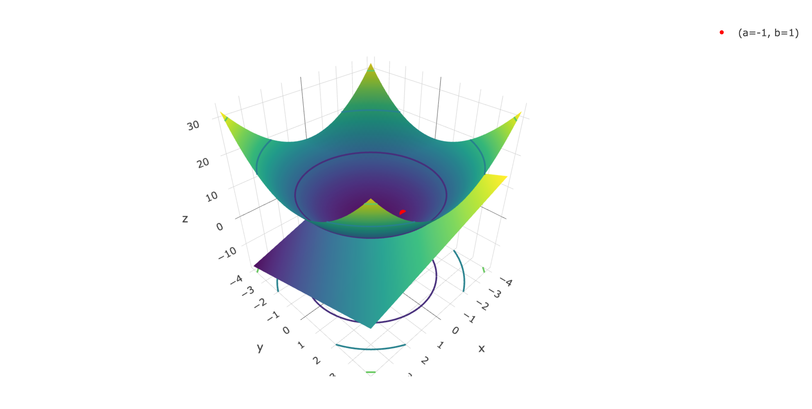
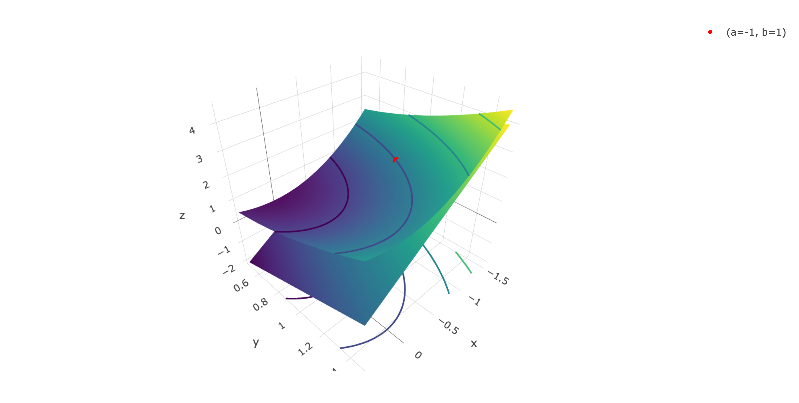
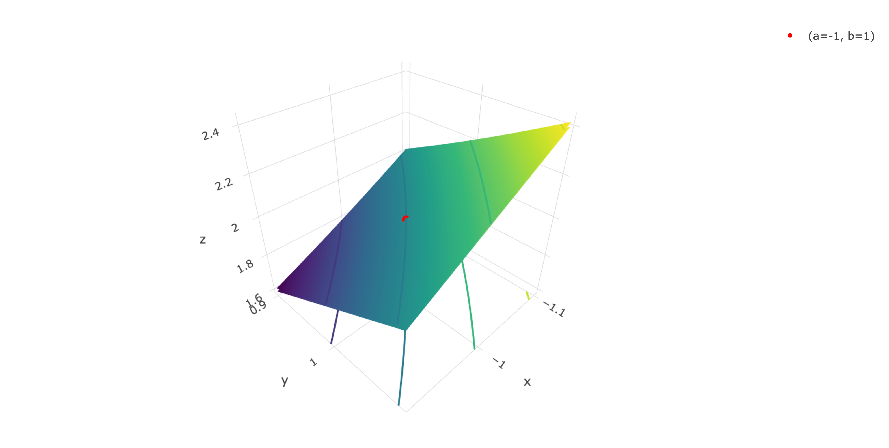

# Tangent planes and linear approximations

```{r, message = FALSE}
library(tidyverse)
library(plotly)
library(dasc2594)
set.seed(2021)
```

Let $f(\mathbf{x})$ be a differentiable function at a point $\mathbf{a}$. Because the function is differentiable at $\mathbf{a}$, this means that all paths $P_\mathbf{a}$ that approach the point $\mathbf{a}$ from all directions all take on values $f(P_\mathbf{a})$ that are "close" to $f(\mathbf{a})$. Mathematically, we describe this as **smoothness**. A more explicit description says that as the paths $P_{\mathbf{a}}$ get very close to $\mathbf{a}$, the space over which these paths are defined starts to look more and more like a flat surface--the **tangent plane**. 

:::{.example}
For this example, we plot the function $f(x, y) = x^2 + y^2$ which has gradient $\nabla f(x, y) = \begin{pmatrix} 2x \\ 2y\end{pmatrix}$
```{r, eval = FALSE}
# f(x, y)
target_fun <- function(x, y) {
    return(x^2 + y^2)
}
# gradient f(x, y)
grad_fun <- function(x, y) {
    c(2 * x, 2 * y) # notice that the return value is a vector
}
# plot 
plot_tangent_plane(target_fun = target_fun, grad_fun = grad_fun, a=-1, b = 1)
# zoomed in plot
plot_tangent_plane(target_fun = target_fun, grad_fun = grad_fun, a=-1, b = 1, xlim = c(-1.5, 0.5), ylim = c(0.5, 1.5))
# super zoomed in plot
plot_tangent_plane(target_fun = target_fun, grad_fun = grad_fun, a=-1, b = 1, xlim = c(-1.1, -0.9), ylim = c(0.9, 1.1))
```


```{r, echo = FALSE, out.width = "100%"}
target_fun <- function(x, y) {
    return(x^2 + y^2)
}
# gradient f(x, y)
grad_fun <- function(x, y) {
    c(2 * x, 2 * y) # notice that the return value is a vector
}

# plot
if (knitr::opts_knit$get("rmarkdown.pandoc.to") %in% c("latex", "docx")) {
    htmlwidgets::saveWidget(plot_tangent_plane(target_fun = target_fun, grad_fun = grad_fun, a=-1, b = 1),
                            file = "./webshot-images/tangent1.html")
    webshot2::webshot(url = "./webshot-images/tangent1.html", 
                      file = "./webshot-images/tangent1.png", 
                      delay = 1, zoom = 4, vheight = 500)
    
    
} else if (knitr::opts_knit$get("rmarkdown.pandoc.to") == "html") {
    # plot 
    plot_tangent_plane(target_fun = target_fun, grad_fun = grad_fun, a=-1, b = 1)
}


# zoomed-in plot
if (knitr::opts_knit$get("rmarkdown.pandoc.to") %in% c("latex", "docx")) {
    htmlwidgets::saveWidget(plot_tangent_plane(target_fun = target_fun, grad_fun = grad_fun, a=-1, b = 1, xlim = c(-1.5, 0.5), ylim = c(0.5, 1.5)),
                            file = "./webshot-images/tangent2.html")
    webshot2::webshot(url = "./webshot-images/tangent2.html", 
                      file = "./webshot-images/tangent2.png", 
                      delay = 1, zoom = 4, vheight = 500)
    
    
} else if (knitr::opts_knit$get("rmarkdown.pandoc.to") == "html") {
    # plot 
    plot_tangent_plane(target_fun = target_fun, grad_fun = grad_fun, a=-1, b = 1, xlim = c(-1.5, 0.5), ylim = c(0.5, 1.5))
    
}


# super zoomed in plot
if (knitr::opts_knit$get("rmarkdown.pandoc.to") %in% c("latex", "docx")) {
    htmlwidgets::saveWidget(plot_tangent_plane(target_fun = target_fun, grad_fun = grad_fun, a=-1, b = 1, xlim = c(-1.1, -0.9), ylim = c(0.9, 1.1)),
                            file = "./webshot-images/tangent3.html")
    webshot2::webshot(url = "./webshot-images/tangent3.html", 
                      file = "./webshot-images/tangent3.png", 
                      delay = 1, zoom = 4, vheight = 500)
    
    
} else if (knitr::opts_knit$get("rmarkdown.pandoc.to") == "html") {
    # plot 
    plot_tangent_plane(target_fun = target_fun, grad_fun = grad_fun, a=-1, b = 1, xlim = c(-1.1, -0.9), ylim = c(0.9, 1.1))

}
```

:::


A consequence of this result that when you zoom in on a differentiable function the function looks like a flat plane is that the function $f(x, y)$ can be approximated locally as a linear function (local approximation just means that if you are really "close" to the point $(a, b)$ that the function will behave like a tangent plane if the function is differentiable). Intuitively, this makes sense as if the derivative exists, the directional derivatives are just vectors and a linear combination of vectors (in $\mathcal{R}^2$) produces a tangent plane (in higher dimensions, this is called a **hyperplane**). This means that if the function $f(x, y)$ is differentiable at the point $(a, b)$, then $f(x, y)$ for points $(x, y)$ close to $(a, b)$ is approximated by the linear tangent plane.


Notice in the code above that there are two functions needed to calculate the tangent plane: the function $f(x, y)$ and the gradient $\nabla f(x, y)$. This can be seen in the definition  of the tangent plane.

:::{.definition name="Tangent plane"}

Let $f(x, y)$ be a differentiable function at the point $(a, b)$. Then the tangent plane to the surface defined by the function $f(x, y)$ at the point $(a, b)$ is given by the equation
$$
\begin{aligned}
z & = f(a, b) + f_x(a, b) (x - a) + f_y(a, b) (y - b) \\
& = f(a, b) + \nabla f(x, y) |_{(a, b)} \cdot \begin{pmatrix} x - a \\ y - b \end{pmatrix} \\
& = f(a, b) + (\nabla f(x, y) |_{ (a, b)})' \begin{pmatrix} x - a \\ y - b \end{pmatrix} \\,
\end{aligned}
$$
where the tangent plane is defined as the dot product of the graidient vector $\nabla f(x, y) |_{(a, b)}$ evaluated at the point $(a, b)$ and the vector $\begin{pmatrix} x - a \\ y - b \end{pmatrix}$ that is the coordinate-wise distance of the point $(x, y)$ from the point $(a, b)$.

:::

:::{.example}
Find the equation for the tangent plane for the function $f(x, y) = x^2 \cos(y) - y^2 \cos(x)$ at the point $(\frac{\pi}{2}, \frac{pi}{4})$

* calculate by hand
* plot using `plot_tangent_plane()`
    
:::


This leads to the linearization equation for functions of $n$ variables. 

:::{.definition name="Linearization of a function"}

Let $f(\mathbf{x})$ be a differentiable function at the point $\mathbf{a} = (a_1, a_2, \ldots, a_n)'$ for a function of inputs $\mathbf{x} = (x_1, x_2, \ldots, x_n)' \in \mathcal{R}^n$. Then the linearization of the function $f(\mathbf{x})$ at the point $\mathbf{a}$ is given by the equation
$$
\begin{aligned}
L(\mathbf{x}) & = f(\mathbf{a}) + \nabla f(\mathbf{x}) |_{\mathbf{a}} \cdot (\mathbf{x} - \mathbf{a}) \\
& = f(\mathbf{a}) + \left( \nabla f(\mathbf{x}) |_{\mathbf{a}} \right)' (\mathbf{x} - \mathbf{a})
\end{aligned}
$$

:::

The quality of the linearization is high for points "close" to $\mathbf{a}$ and has higher error (defined as $\|L(\mathbf{x}) - f(\mathbf{x})\|$) as $\mathbf{x}$ gets further from $\mathbf{a}$.

For points $\mathbf{x}$ "close" to the point $\mathbf{a}$, the exact difference in the function $z = f(\mathbf{x})$ is given by $\Delta z =  f(\mathbf{x}) - f(\mathbf{a})$. Plugging in the linear approximation, the differential $d z = L(\mathbf{x}) - f(\mathbf{a})$ is the linear approximation to the exact different $\Delta z$. Define $d \mathbf{x} = \begin{pmatrix} d x_1 \\ d x_2 \\ \vdots \\ d x_n \end{pmatrix} = \begin{pmatrix} x_1 - a_1 \\ x_2 - a_2 \\ \vdots \\ x_n - a_n \end{pmatrix}$ as the set of changes in each of the $n$ coordinates with respect to the standard basis $\{\mathbf{e}_1, \mathbf{e}_2, \ldots, \mathbf{e}_n\}$ so that the linear change $d z$ of $f(\mathbf{x})$ at $\mathbf{a}$ is given by 

$$
\begin{aligned}
d z & =  \nabla f(\mathbf{x}) |_{\mathbf{a}} \cdot (\mathbf{x} - \mathbf{a}) \\
& = \nabla f(\mathbf{x}) |_{\mathbf{a}} \cdot d \mathbf{x} \\
& = \sum_{i=1}^n \frac{\partial f(\mathbf{x})}{\partial x_i} d x_i,
\end{aligned}
$$
where the last term is a sum of the linear approximation in each of the $i = 1, \ldots, n$ coordinate directions.

:::{.example}
Approximate the linear change of the function $f(x, y, z) = x^2 - 3xy^2z^2 - 4z^2$ at the point $(a, b, c) = (1, -2, -1)$ evaluated at the point $(x, y, z) = (0.95, -2.05, -1.05)$. Compare this to the exact value of the function $f(x, y, z)$


```{r, echo = FALSE}
target_fun <- function(x, y, z) {
        x^2 - 3 * x * y^2 * z^2 - 4 * z^2
} 
        
grad_fun <- function(x, y, z) {
        c(2*x - 3 * y^2 * z^2,
          -6 * x * y * z^2,
          -6 * x * y^2 * z - 8 * z)
}


linearization <- function(target_fun, grad_fun, x, y, z, a, b, c) {
        target_fun(a, b, c) + sum(grad_fun(a, b, c) * c(x - a, y - b, z - c))
}

```

First, we find the gradient 

$$
\begin{aligned}
\nabla f(x, y, z) = \begin{pmatrix} 2x - 3y^2z^2 \\ -6xyz^2 \\ -6xy^2z - 8z \end{pmatrix}
\end{aligned}
$$

and evaluate the gradient at $(a, b, c) = (1, -2, -1)$ to get 

$$
\begin{aligned}
\nabla f(1, -2, -1) = \begin{pmatrix} 2(1) - 3(-2)^2(-1)^2 \\ -6(1)(-2)(-1)^2 \\ -6(1)(-2)^2(-1) - 8(-1) \end{pmatrix} = `r array_to_latex(matrix(grad_fun(1, -2, -1), 3, 1))` 
\end{aligned}
$$

The function evaluated at the point $(a, b, c)$ is $f(1, -2, -1) = (1)^2 - 3(1)(-2)^2(-1)^2 - 4(-1)^2 = -15$.

Therefore, the linear approximation $L(x, y, z)$ of $f(x, y, z)$ at the point $(a, b, c)$ is 

$$
\begin{aligned}
L(x, y, z) & = f(a, b, c) + \nabla f(a, b, c) \cdot \begin{pmatrix} x - 1 \\ y - (-2) \\ z - (-1) \end{pmatrix} \\
& = -15 + 10(x - 1) - 12 (y + 2) - 32 (z + 1)
\end{aligned}
$$

The linear approximation evaluated at the point $(0.95, -2.05, -1.05)$ is 
$$
\begin{aligned}
L(0.95, -2.05, -1.05) & = -15 + 10(0.95 - 1) - 12 (-2.05 + 2) - 32 (-1.05 + 1) = -16.7.
\end{aligned}
$$

Compared to the true value of the function $f(x, y, z)$ is 

$$
\begin{aligned}
f(0.95, -2.05, -1.05) & = (1.05)^2 - 3(1.05)(-2.05)^2(-1.05)^2 - 4(-1.05)^2 = -16.71228,
\end{aligned}
$$
which gives an approximation error of $f(x, y, z) - L(x, y, z) = `r target_fun(0.95, -2.05, -1.05)` - `r linearization(target_fun, grad_fun, 0.95, -2.05, -1.05, 1, -2, -1)` = `r target_fun(0.95, -2.05, -1.05) - linearization(target_fun, grad_fun, 0.95, -2.05, -1.05, 1, -2, -1)`$

```{r}
target_fun <- function(x, y, z) {
        x^2 - 3 * x * y^2 * z^2 - 4 * z^2
} 
        
grad_fun <- function(x, y, z) {
        c(2*x - 3 * y^2 * z^2,
          -6 * x * y * z^2,
          -6 * x * y^2 * z - 8 * z)
}

grad_fun(1, -2, -1)

target_fun(0.95, -2.05, -1.05)

linearization <- function(target_fun, grad_fun, x, y, z, a, b, c) {
        target_fun(a, b, c) + sum(grad_fun(a, b, c) * c(x - a, y - b, z - c))
}


linearization(target_fun, grad_fun, 0.95, -2.05, -1.05, 1, -2, -1)
target_fun(0.95, -2.05, -1.05)

# approximation error
target_fun(0.95, -2.05, -1.05) - linearization(target_fun, grad_fun, 0.95, -2.05, -1.05, 1, -2, -1)

```

:::


