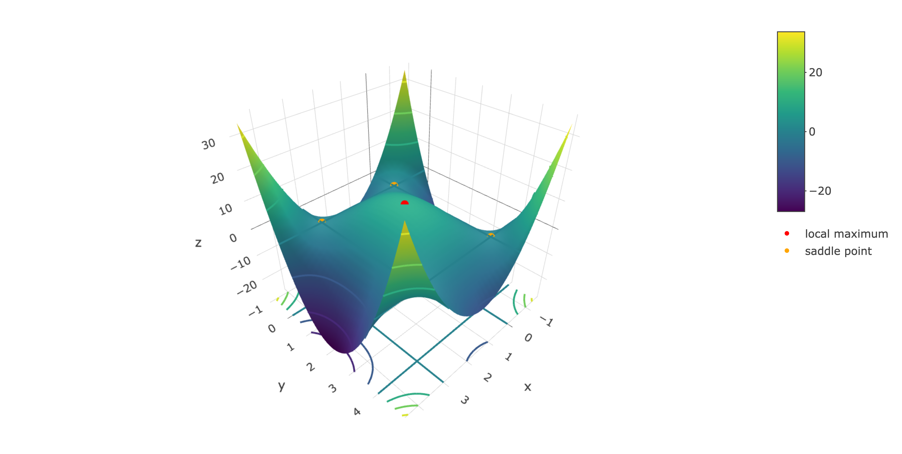
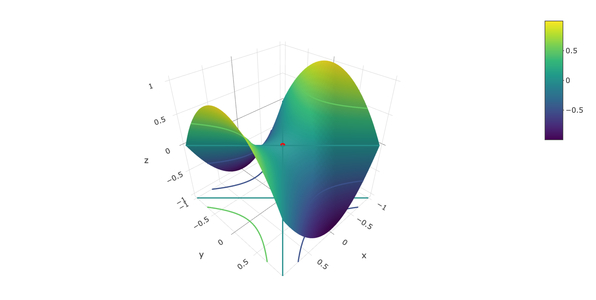
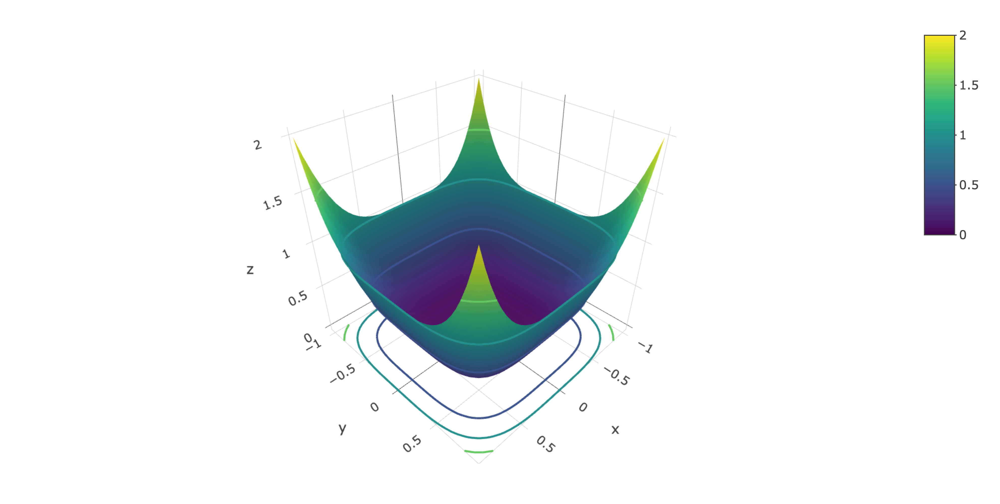

# Minimums and Maximums

```{r, message = FALSE}
library(tidyverse)
library(plotly)
library(dasc2594)
set.seed(2021)
```


In general, we talk about finding either minimums or maximum values of a function. For simplicity, we focus here on finding the minimum value of a function $f(\cdot)$ because finding the maximum value of $f(\cdot)$ is equivalent to finding the minimum value of $-f(\cdot)$.

To characterize these minimum values, we consider two different types of minimums: local minimums and global minimums. For now, we focus on functions of two variables but these ideas are similar for functions of many variables. 

## Local minimums

A local minimum of the function $f(x, y)$ is a point $(a, b)$ where the values of the function $f(a, b)$ evaluated at $(a, b)$ is less than or equal to the function $f(a + \Delta x, b + \Delta y)$ at any nearby point $(a + \Delta x, b + \Delta y)$, where $\Delta x$ and $\Delta y$ are very small values. 

:::{.definition}
Let $(a, b)$ be a point in the domian $\mathcal{D}$ of the function $f(x, y)$. If there exists an $\epsilon > 0$ such that $\|(x, y) - (a, b)\| < \epsilon$ (the point $(x, y)$ is close to the point $(a, b)$ for a given disk of radius $\epsilon$ at the point $(a, b)$), then if $f(a, b) \leq f(x, y)$, the point $(a, b)$ is called a **local minimum** value of the function $f(x, y)$.
:::

In terms of finding a minimum of a surface, the local minimum is any point on the surface from which one cannot walk downhill if one can only take small steps. Like in univariate functions, local minimums also have a relationship to the partial derivatives. 

:::{.theorem}
If $f(x, y)$ has a local minimum at the point $(a, b)$ and $f(x, y)$ is a differentiable function at $(a, b)$, then the partial derivatives $\frac{\partial f(x, y)}{\partial x}|_{(a, b)} = f_x(a, b) = 0$ and $\frac{\partial f(x, y)}{\partial y}|_{(a, b)} = f_y(a, b) = 0$
:::

**Note:** the converse is not necessarily true: just because $f_x(a, b) = 0$ and $f_y(a, b) = 0$, this doesn't mean that we have a minimum point at $(a, b)$.

As stated above, the fact that the partial derivatives $f_x(a, b) = 0$ and $f_y(a, b) = 0$ does not imply that the point $(a, b)$ is a local minimum. Instead, the partial derivatives being 0 only implies that $(a, b)$ is a critical point of the function $f(x, y)$. 

:::{.definition}
The point $(a, b)$ is a critical point of the function $f(x, y)$ if either

a) $f_x(a, b) = 0$ and $f_y(a, b) = 0$ or

b) at least one partial derivative does not exist at $(a, b)$.

:::


:::{.example}
find the critical points of $f(x, y) = xy(x - 3)(y - 4)$.
* plot the critical points using `plotly()`

```{r}
f <- function(x, y) {
    x * y * (x - 3) * (y - 4)
}
x <- seq(3/2 + -3, 3/2 + 3, length.out = 40)
y <- seq(2 + -3, 2 + 3, length.out = 40)

critical_points <- data.frame(x = c(3/2, 0, 3, 0, 3), y = c(2, 0, 0, 4, 4)) %>%
    mutate(z = f(x, y), color = c("red", rep("orange", 4)), name = c("local minimum", rep("saddle point", 4)))
dat <- expand_grid(x, y) %>%
    mutate(z = f(x, y))

dat %>%
    ggplot(aes(x = x, y = y, z = z)) +
    geom_contour(bins = 40) +
    coord_fixed(ratio = 1) +
    geom_point(data = critical_points, aes(color = name), size = 2) +
    scale_color_manual(values = critical_points$color)
```


```{r, eval = FALSE}
plot_ly(x = x, y = y, z = matrix(dat$z, 40, 40)) %>%
    add_surface(
        contours = list(
            z = list(
                show=TRUE,
                usecolormap=TRUE,
                highlightcolor="#ff0000",
                project=list(z=TRUE)))) %>%
    add_trace(x = critical_points$x, y = critical_points$y, 
              z = critical_points$z,
              mode = "markers", type = "scatter3d", 
              marker = list(size = 5, 
                            color = c("red", rep("orange", 4)), 
                            symbol = 104),
              name = c("local maximum", rep("saddle point", 4)))
```


```{r, echo = FALSE, out.width="100%"}
if (knitr::opts_knit$get("rmarkdown.pandoc.to") %in% c("latex", "docx")) {
    htmlwidgets::saveWidget(
        plot_ly(x = x, y = y, z = matrix(dat$z, 40, 40)) %>%
            add_surface(
                contours = list(
                    z = list(
                        show=TRUE,
                        usecolormap=TRUE,
                        highlightcolor="#ff0000",
                        project=list(z=TRUE)))) %>%
            add_trace(x = critical_points$x, y = critical_points$y, 
                      z = critical_points$z,
                      mode = "markers", type = "scatter3d", 
                      marker = list(size = 5, 
                                    color = c("red", rep("orange", 4)), 
                                    symbol = 104),
                      name = c("local maximum", rep("saddle point", 4))),
        file = "./webshot-images/critical.html")
    webshot2::webshot(url = "./webshot-images/critical.html", 
                      file = "./webshot-images/critical.png", 
                      delay = 1, zoom = 4, vheight = 500)
    

} else if (knitr::opts_knit$get("rmarkdown.pandoc.to") == "html") {
    plot_ly(x = x, y = y, z = matrix(dat$z, 40, 40)) %>%
        add_surface(
            contours = list(
                z = list(
                    show=TRUE,
                    usecolormap=TRUE,
                    highlightcolor="#ff0000",
                    project=list(z=TRUE)))) %>%
        add_trace(x = critical_points$x, y = critical_points$y, 
                  z = critical_points$z,
                  mode = "markers", type = "scatter3d", 
                  marker = list(size = 5, 
                                color = c("red", rep("orange", 4)), 
                                symbol = 104),
                  name = c("local maximum", rep("saddle point", 4)))
}
```
:::


If a critical point isn't a local minimum/maximum, what else could this point be? One possible shape is what is called a saddle point. A saddle point is one in which the function $f(x, y)$ is increasing in one direction (say, along the x-axis) and decreasing along another direction (say, the y-axis). The surface is often said to resemble the shape of a saddle (or a Pringles chip). An example saddle point is shown in the plot below.

```{r, eval = FALSE}
f <- function(x, y) {
    x^2 - y^2
}
x <- seq(-1, 1, length.out = 40)
y <- seq(-1, 1, length.out = 40)
critical_points <- data.frame(x = 0, y = 0) %>%
    mutate(z = f(x, y))
dat <- expand_grid(x, y) %>%
    mutate(z = f(x, y))

plot_ly(x = x, y = y, z = matrix(dat$z, 40, 40)) %>%
    add_surface(
        contours = list(
            z = list(
                show=TRUE,
                usecolormap=TRUE,
                highlightcolor="#ff0000",
                project=list(z=TRUE)))) %>%
    add_trace(x = critical_points$x, y = critical_points$y, 
              z = critical_points$z,
              mode = "markers", type = "scatter3d", 
              marker = list(size = 5, 
                            color = "red",
                            symbol = 104),
              name = "saddle point")
```

```{r, echo = FALSE, out.width="100%"}
f <- function(x, y) {
    x^2 - y^2
}
x <- seq(-1, 1, length.out = 40)
y <- seq(-1, 1, length.out = 40)
critical_points <- data.frame(x = 0, y = 0) %>%
    mutate(z = f(x, y))
dat <- expand_grid(x, y) %>%
    mutate(z = f(x, y))


if (knitr::opts_knit$get("rmarkdown.pandoc.to") %in% c("latex", "docx")) {
    htmlwidgets::saveWidget(
        plot_ly(x = x, y = y, z = matrix(dat$z, 40, 40)) %>%
            add_surface(
                contours = list(
                    z = list(
                        show=TRUE,
                        usecolormap=TRUE,
                        highlightcolor="#ff0000",
                        project=list(z=TRUE)))) %>%
            add_trace(x = critical_points$x, y = critical_points$y, 
                      z = critical_points$z,
                      mode = "markers", type = "scatter3d", 
                      marker = list(size = 5, 
                                    color = "red",
                                    symbol = 104),
                      name = "saddle point"),
        file = "./webshot-images/saddle.html")
    webshot2::webshot(url = "./webshot-images/saddle.html", 
                      file = "./webshot-images/saddle.png", 
                      delay = 1, zoom = 4, vheight = 500)
    
    
    
} else if (knitr::opts_knit$get("rmarkdown.pandoc.to") == "html") {
    plot_ly(x = x, y = y, z = matrix(dat$z, 40, 40)) %>%
        add_surface(
            contours = list(
                z = list(
                    show=TRUE,
                    usecolormap=TRUE,
                    highlightcolor="#ff0000",
                    project=list(z=TRUE)))) %>%
        add_trace(x = critical_points$x, y = critical_points$y, 
                  z = critical_points$z,
                  mode = "markers", type = "scatter3d", 
                  marker = list(size = 5, 
                                color = "red",
                                symbol = 104),
                  name = "saddle point")
}
```


:::{.definition name="Saddle point"}

A saddle point of a differentiable function $f(x, y)$ is a critical point $(a, b)$ of $f(x, y)$ where for all $\epsilon > 0$ there exists points $(x, y)$ within the disk of radius $\epsilon$ of the point $(a, b)$ (i.e., $\|(x, y) - (a, b)\| < \epsilon$) where $f(x, y) > f(a, b)$ and where $f(x, y) < f(a, b)$. In other words, there are points nearby the critical point that have both higher and lower values than the value $f(a, b)$. 

:::


Finding critical points is a first step in finding minimums, however, we need a method to determine whether a critical point is a local minimum/maximum or a saddle point. To determine this, the second derivative test is useful. 

:::{.theorem name="Second Derivative Test"}

Let $f_x(a, b) = f_y(a, b) = 0$ so that the point $(a, b)$ is a critical point. Also let the $f(x, y)$ be second-order differentiable (the second partial derivatives exists) throughout the open disk $\| (x, y) - (a, b)\|< \epsilon$ for some $\epsilon > 0$. Then

1) If $f_{xx}(a, b)f_{yy}(a, b) - (f_{xy}(a, b))^2 > 0$ and $f_{xx}(a, b) < 0$, then $f(x, y)$ has a local maximum at $(a, b)$.

2) If $f_{xx}(a, b)f_{yy}(a, b) - (f_{xy}(a, b))^2 > 0$ and $f_{xx}(a, b) > 0$, then $f(x, y)$ has a local minimum at $(a, b)$.

3) If $f_{xx}(a, b)f_{yy}(a, b) - (f_{xy}(a, b))^2 < 0$, then $f(x, y)$ has a saddle point at $(a, b)$.

4) If $f_{xx}(a, b)f_{yy}(a, b) - (f_{xy}(a, b))^2 = 0$, the test is inconclusive.

:::


:::{.example}
find the critical points of $f(x, y) = xy(x - 3)(y - 4)$ and determine if they are local maxima, minima, saddle points, or undetermined.
:::


:::{.example}
find the critical points of $f(x, y)  = x^4 + y^4$ and determine if they are local maxima, minima, saddle points, or undetermined.
:::

```{r, eval = FALSE}
f <- function(x, y) {
    x^4 + y^4
}
x <- seq(-1, 1, length.out = 40)
y <- seq(-1, 1, length.out = 40)
critical_points <- data.frame(x = 0, y = 0) %>%
    mutate(z = f(x, y))
dat <- expand_grid(x, y) %>%
    mutate(z = f(x, y))

plot_ly(x = x, y = y, z = matrix(dat$z, 40, 40)) %>%
    add_surface(
        contours = list(
            z = list(
                show=TRUE,
                usecolormap=TRUE,
                highlightcolor="#ff0000",
                project=list(z=TRUE)))) %>%
    add_trace(x = critical_points$x, y = critical_points$y, 
              z = critical_points$z,
              mode = "markers", type = "scatter3d", 
              marker = list(size = 5, 
                            color = "red",
                            symbol = 104),
              name = "saddle point")
```

```{r, echo = FALSE, out.width="100%"}
f <- function(x, y) {
    x^4 + y^4
}
x <- seq(-1, 1, length.out = 40)
y <- seq(-1, 1, length.out = 40)
critical_points <- data.frame(x = 0, y = 0) %>%
    mutate(z = f(x, y))
dat <- expand_grid(x, y) %>%
    mutate(z = f(x, y))

if (knitr::opts_knit$get("rmarkdown.pandoc.to") %in% c("latex", "docx")) {
    htmlwidgets::saveWidget(
plot_ly(x = x, y = y, z = matrix(dat$z, 40, 40)) %>%
    add_surface(
        contours = list(
            z = list(
                show=TRUE,
                usecolormap=TRUE,
                highlightcolor="#ff0000",
                project=list(z=TRUE)))) %>%
    add_trace(x = critical_points$x, y = critical_points$y, 
              z = critical_points$z,
              mode = "markers", type = "scatter3d", 
              marker = list(size = 5, 
                            color = "red",
                            symbol = 104),
              name = "saddle point"),
        file = "./webshot-images/saddle2.html")
    webshot2::webshot(url = "./webshot-images/saddle2.html", 
                      file = "./webshot-images/saddle2.png", 
                      delay = 1, zoom = 4, vheight = 500)
    
    
    
} else if (knitr::opts_knit$get("rmarkdown.pandoc.to") == "html") {
    plot_ly(x = x, y = y, z = matrix(dat$z, 40, 40)) %>%
        add_surface(
            contours = list(
                z = list(
                    show=TRUE,
                    usecolormap=TRUE,
                    highlightcolor="#ff0000",
                    project=list(z=TRUE)))) %>%
        add_trace(x = critical_points$x, y = critical_points$y, 
                  z = critical_points$z,
                  mode = "markers", type = "scatter3d", 
                  marker = list(size = 5, 
                                color = "red",
                                symbol = 104),
                  name = "saddle point")
}
```


## Global maximums and minimums

We have shown how you can find critical points $(a, b)$ by finding points that have 0 partial derivatives in each direction ($f_x(a, b) = f_y(a, b) = 0$) and we have shown how to characterize  these critical points using the second derivative test. In data science, we are often interested in finding the "best" model, not just the "best local" model. So a question arises is whether the local minima/maxima that we find are the global minima/maxima.  To determine this, we have to define the global minima/maxima.

:::{.definition}
If $f(x, y)$ is a function defined over a domain (or a subset of the domain) $\mathcal{D} \in \mathcal{R}^2$ that contains the point $(a, b)$, we say 

* $(a, b)$ is a **global maximum** if $f(a, b) \geq f(x, y)$ for all $(x, y) \in \mathcal{D}$ and

* $(a, b)$ is a **global minimum** if $f(a, b) \leq f(x, y)$ for all $(x, y) \in \mathcal{D}$.
:::

Thus, once you have found all the critical points, you also need to check all the boundary points for the domain (or subdomain) $\mathcal{D}$ as the global minimum/maximum might lie on the boundary. 

In general finding the global maximum/minimum points can be done by applying the following procedure:

:::{}
Let $f(x, y)$ be a function on a closed (the set contains its boundary points) and bounded (the set is not infinite) set. Then, the global minima/maxima can be found by 

1) Determining the values $f(x, y)$ at all the critical points.

2) Determining the values of $f(x, y)$ at all the boundary points of $\mathcal{D}$.

3) Finding the minimum/maximum of the set of function values from 1) and 2). 

:::

:::{.example}
Let $f(x, y) = x^2 - 4xy + y^2$ over the region $[-2,2]\times[-2, 2]$
:::


In data science problems, it is often difficult to analyze the functions analytically (using the tools of calculus directly). Instead, one can use numeric techniques to find minima and maxima. Two techniques that we will discuss are grid search and gradient descent. 

## Grid search optimization

If the number of input variables in the function is small, one can find global minima and maxima using grid search. To find a global minima/maxima in $\mathcal{R}^2$, one creates a grid over the domain $\mathcal{D}$ and evaluates the function $f(x, y)$ at these grid points and finds the numerical solution.

:::{.example}
Let $f(x, y) = x^2 - 2xy + y^2$ over the region $[-2,2]\times[-2, 2]$

```{r}
target_fun <- function(x, y) {
    x^2 - 4 * x * y + y^2
}
# N is the grid size
N <- 1000
x <- seq(-2, 2, length.out = N)
y <- seq(-2, 2, length.out = N)
dat <- expand_grid(x = x, y = y) %>%
    mutate(z = target_fun(x, y))
# find the minimum
dat %>%
    filter(z == min(z))

# find the minimum
dat %>%
    filter(z == max(z))
```

:::

## Gradient Descent

Another method to find minima/maxima is gradient descent. 

